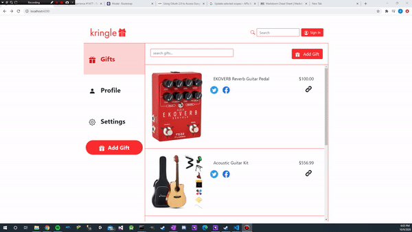

# Kringle

Kringle is a personal project created by Alec Shunnarah to demo an idea for a social media app that revolves around a gift registry. The MVP version of Kringle is designed to allow users to create a Kringle account using OAuth2 authentication with Google and Facebook, and to allow users to add the gifts they would want to a personal gift registry. The MVP should allow users to add a "wish list" of items they see across the internet, and allow them to export and share that list of gifts seamlessly to other platforms and devices.

---

## Tech Stack

### Angular

Angular is a front-end framework developed and maintained by Google.

### Django

Django provides middle-layer programming in Python. It is used to communicate between the server and the Angular framework.

### DB (Not Implemented Yet)

Looking to use either a relational database or a NoSQL database stored in an AWS cloud to store the gift lists that users create.

## Current Progress

As of now only the front-end has been developed using Angular and some dummy data created in TypeScript. The design of the desktop app
will be a single-page application that allows the user to access different sections of the app from a single root route.

